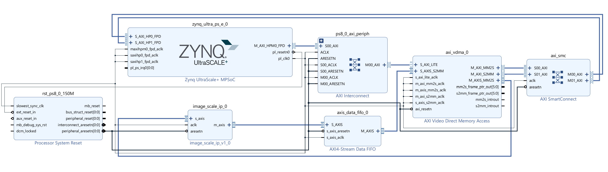
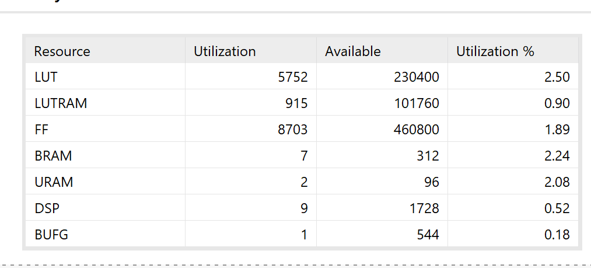
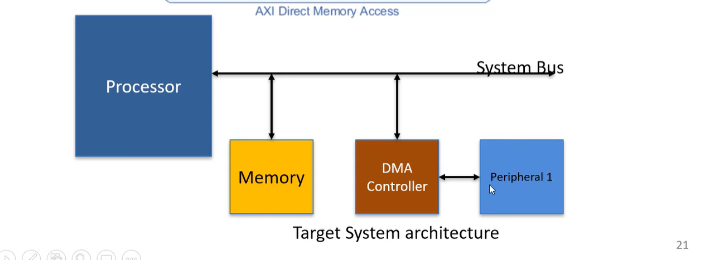

# AXI-Stream-bilinear-Image-scaling-IP
Designed a 6-stage bilinear image scaling pipeline and streaming the image using line buffers method reducing the memory utilization.
Successfully verified on zynq Ultrscale + FPGA SOC with minimal resource utilization.
---

## Key Design Features

- **3-line buffer architecture**  
  Used a 3 line buffer architecture for image streaming using AXI-4 stream which reduces the on-chip memory utilization compared to full frame buffering.

- **Input and output FIFO**  
  Used input and output FIFO buffers to avoid stalling of the image pipeline if the DMA is slowing processing the data to the memory again.

- **Video Direct memory access**  
  we use VDMA to stream the data from the DDR memory in the Zynq UltraScale FPGA because the normal DMA doesn't know where the row ends ,but VDMA streams the image data as a row wise packet compared to DMA which sends the data as a whole packet as it doesn't recognise image and data separately.

- **Fixed point arithmetic for bilinear interpolation**  
  used 8 bit fractional part for good accuracy in the pixel intensity values and using lesser hardware for image scaling.
  
---

## Architecture Overview

## Synthesis and timing reports

## DMA (Direct memory access)

